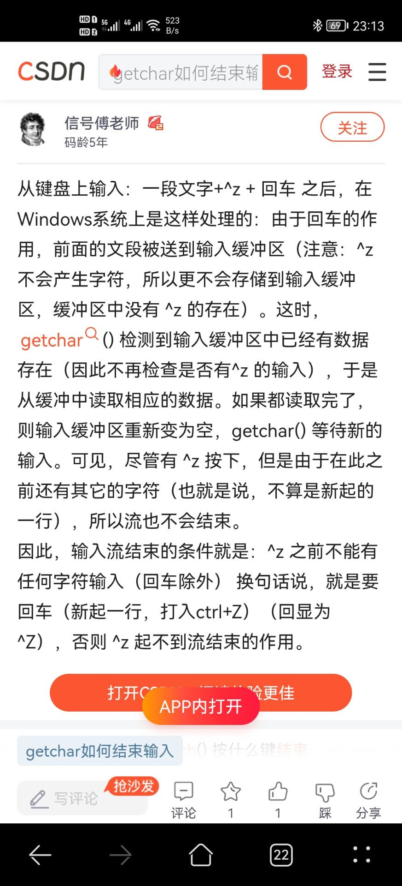

# 输入函数

## getchar()
getchar函数是一种输入函数，其声明为：

```c
int getchar(void);
```
由此看出，该函数只要是buffer里面有，在读取完一个字符之后就会读下一个字符
```c
#include <stdio.h>
#include <stdlib.h>

int main(){
    int ch;
    while(ch=getchar())
        printf("%d\n",ch);
    return 0;
}
```
input:
```
1
```
output:

```
49
10
```
getchar因为输入回车所以才开始扫描，但是输入进去的除了数字还有回车，所以会打印这两个字符的ASCII码

### 关于^Z与EOF



[有关资料](https://blog.csdn.net/chenming092100/article/details/79583189) 


发现`getchar`输入的^Z只要是前面有字符就不会识别成EOF，而是识别成ASCII26的字符``

无论^Z之前有无字符，其后的字符均无效

猜想：当`\n`输入之后，送入缓冲区的是``。检查这个字符之前有没有字符，如果有的话就将``判定为^Z，不做判定并且清空缓冲区

## gets()

全称：get string

函数声明为
`c
char * gets(char * a);
`
该函数特点：是扫描字符串的函数，该函数遇回车符停止输入，并且将回车符从buffer移走

**PS.与scanf函数的区别**
1. scanf函数遇到空格，tab，回车停止输入，并且将这些留在buffer；而gets函数会读入空格，tab(变成'\t')，遇到回车停止输入，并移走回车
2. scanf函数在读到非空白字符之前会**忽略回车(意思是清除这个回车)**(这也是为什么多个scanf循环没有问题,每次scanf循环都会清除上一次的回车)；如果gets函数在读到空白字符之前直接打回车的话，也是直接清走回车
3. gets是可以读回车的，但是是从(上一次的)缓冲区里面找
4. scanf("");可以清空缓冲区残留的所有空白字符

例：

```c
#include <stdio.h>
#include <stdlib.h>
int main(){
    char a[10];
    gets(a);
    char b=*a;
    printf("..%c..",b);
    return 0;
}
```

input:
```
('\n')
```
output:
```
....
```
说明get不能读入回车(并清空(清空的验证方式:后面加一个getchar,发现程序中断))
另例：

```c
#include <stdio.h>
#include <stdlib.h>
int main(){
    char a[10],b[10],c[10];
    scanf("%s%s",a,b);
    gets(c);
    puts(a);
    puts(b);
    puts(c);
    puts("ended here");
    return 0;
}
```

input:
```
12 34
```
output:
```
12
34

ended here
```
说明gets函数从上一次的缓冲区读取了回车。
可总结：这次的回车是当作分隔符，但是上次的回车是当作了char，所以要读入

具体见[csdn](https://blog.csdn.net/weixin_42512488/article/details/82831952?ops_request_misc=%257B%2522request%255Fid%2522%253A%2522164543963016780271520767%2522%252C%2522scm%2522%253A%252220140713.130102334.pc%255Fall.%2522%257D&request_id=164543963016780271520767&biz_id=0&utm_medium=distribute.pc_search_result.none-task-blog-2~all~first_rank_ecpm_v1~rank_v31_ecpm-1-82831952.pc_search_result_cache&utm_term=gets%E5%87%BD%E6%95%B0&spm=1018.2226.3001.4187)


## scanf函数

scanf函数有关`scanf("%d\n",&a);`之中\n的问题  
第一次输入数字和回车后第一个回车会当作分隔符，所以scanf不会看见这个回车(该回车还在缓冲区内)，所以会等待一个回车；第二次随便输入一个数据，按下回车之后这时scanf发现第一个按下的回车不是分隔符，所以吸收该回车